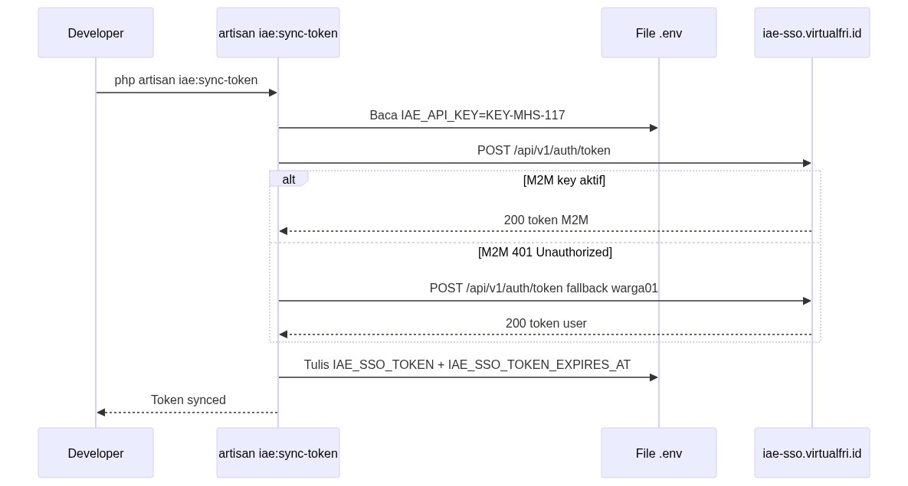
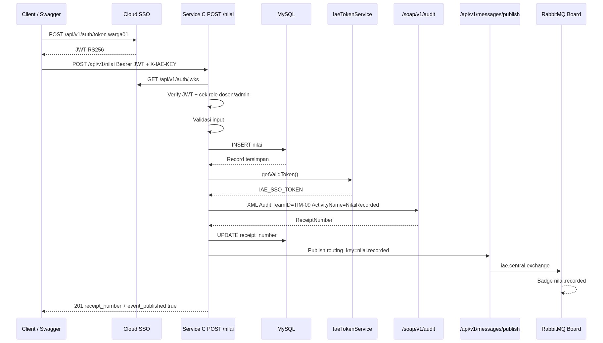

# Analisis Tugas 3 — Service C (Kurikulum & Nilai)

**Mahasiswa:** Andi Muh. Arif Darma Saputra M  
**NIM:** 102022580023  
**Tim Lab:** TIM-09  
**Layanan:** Service C — Validasi Prasyarat & Kurikulum  
**Cloud Pusat:** https://iae-sso.virtualfri.id

---

## 1. Justifikasi Transaksi Kritis

Di Service C saya ada tiga endpoint utama. Dari ketiganya, hanya **`POST /api/v1/nilai`** yang dipakai untuk integrasi Tugas 3. Endpoint GET (`/api/v1/kurikulum` dan `/api/v1/nilai`) cuma baca data, jadi tidak perlu audit SOAP maupun broadcast RabbitMQ.

### Transaksi Penting (SOAP): `POST /api/v1/nilai`

Endpoint ini menambah data nilai baru ke database. Karena datanya resmi dan dipakai untuk IPS, prasyarat, dan kelulusan, setiap pencatatan nilai wajib diberi jejak audit ke Cloud Pusat lewat SOAP. Setelah audit berhasil, server mengembalikan **`ReceiptNumber`** sebagai bukti. Contoh dari testing saya: `IAE-LOG-2026-828A266C`.

### Transaksi yang Disebarkan (RabbitMQ): `POST /api/v1/nilai`

Transaksi yang sama juga perlu disebar ke service lain. Setelah nilai tersimpan dan audit SOAP selesai, Service C mengirim event **`nilai.recorded`** ke Cloud Pusat agar unit lain seperti KRS, wisuda, atau laporan tahu ada nilai baru tanpa harus mengecek Service C terus-menerus.

Alur singkatnya: user login SSO → kirim POST /nilai → data disimpan → audit SOAP → publish RabbitMQ → response sukses dengan receipt number.

---

## 2. Integrasi Federated SSO

Sebelum bisa input nilai, user harus login dulu lewat Cloud Pusat dan dapat JWT. Service C memverifikasi token tersebut, lalu mengecek role lokal.

Yang boleh input nilai hanya role **dosen** dan **admin**. Role **mahasiswa** dan **guest** ditolak. Untuk keperluan lab, akun `warga01@ktp.iae.id` dimapping sebagai dosen sehingga bisa dipakai testing lewat Swagger.

### Token yang Dipakai di Swagger

Saat testing lewat Swagger, ada dua hal yang perlu di-authorize — keduanya **bukan** token dari `IAE_SSO_TOKEN` di `.env`.

**1. X-IAE-KEY** — ini bukan token, melainkan NIM saya: `102022580023`. Dipakai sebagai identitas service saat akses API Service C. Di Swagger, isi **Authorize → X-IAE-KEY** dengan NIM ini.

**2. bearerAuth (JWT)** — ini token login user dari Cloud Pusat. Cara dapatnya: login pakai akun warga01 ke `POST /api/v1/auth/token` di Cloud Pusat, lalu copy JWT yang dikembalikan. Token ini dipaste di Swagger bagian **Authorize → bearerAuth**. JWT ini bukti bahwa yang input nilai adalah dosen yang sudah login SSO.

Perintah buat dapat JWT untuk Swagger:

```bash
curl -X POST "https://iae-sso.virtualfri.id/api/v1/auth/token" \
  -H "Content-Type: application/json" \
  -d '{"email":"warga01@ktp.iae.id","password":"KtpDigital2026!"}'
```

Dari response JSON, copy nilai field **`token`** lalu paste ke Swagger → **Authorize → bearerAuth**.

### API Key Tim (`KEY-MHS-117`)

Selain JWT dan X-IAE-KEY, ada satu key lagi: **API Key M2M** tim saya yaitu `KEY-MHS-117`. Key ini disimpan di `.env` sebagai `IAE_API_KEY` dan **tidak dipakai di Swagger**.

Fungsinya: Service C pakai API Key ini buat minta token ke Cloud Pusat secara otomatis (machine-to-machine). Token hasilnya masuk ke `IAE_SSO_TOKEN` lewat command `iae:sync-token`, lalu dipakai internal saat kirim SOAP audit dan publish RabbitMQ. Jadi identitas yang muncul di board RabbitMQ adalah tim **TIM-09 / TEAM-09**, bukan akun warga01.

Perintah cek apakah API Key sudah aktif:

```bash
curl -s -X POST "https://iae-sso.virtualfri.id/api/v1/auth/token" \
  -H "Content-Type: application/json" \
  -d '{"api_key":"KEY-MHS-117"}'
```

Kalau balas **HTTP 200** berarti API Key aktif. Kalau **401** berarti belum aktif — saat sync token, sistem otomatis fallback ke login warga01.

Perintah sync token outbound ke `.env` (pakai API Key di atas):

```bash
php artisan iae:sync-token
```

### Perbedaan Singkat

| | Nilai | Dipakai di | Fungsi |
|---|---|---|---|
| **X-IAE-KEY** | `102022580023` (NIM) | Swagger | Identitas service saat akses API Service C |
| **JWT (bearerAuth)** | Dari login warga01 | Swagger | Bukti user sudah SSO, buat POST /nilai |
| **API Key M2M** | `KEY-MHS-117` | `.env` saja | Service C minta token outbound ke Cloud Pusat |
| **IAE_SSO_TOKEN** | Auto dari sync-token | `.env` saja | Service C kirim SOAP & RabbitMQ ke Cloud Pusat |

Contoh response sukses setelah POST /nilai:

```json
{
  "status": "success",
  "message": "Nilai berhasil dicatat",
  "data": {
    "id": 14,
    "nim": "2099000015",
    "kode_matkul": "SI302",
    "nama_matkul": "Jaringan Komputer",
    "nilai_huruf": "A",
    "nilai_angka": 4,
    "sks": 3,
    "semester": 3,
    "tahun_ajaran": "2025/2026",
    "recorded_by": "warga01@ktp.iae.id",
    "receipt_number": "IAE-LOG-2026-828A266C",
    "event_published": true
  }
}
```

---

## 3. Integrasi SOAP Audit

Setelah nilai tersimpan, Service C mengirim log audit ke Cloud Pusat lewat SOAP. Data yang dikirim mencakup NIM, kode mata kuliah, dan nilai huruf. Cloud Pusat membalas dengan status sukses dan **`ReceiptNumber`**.

Receipt number ini disimpan bersama data nilai, jadi setiap pencatatan nilai punya bukti audit yang bisa dilacak. Di implementasi saya, audit memakai `TeamID=TIM-09` dan `ActivityName=NilaiRecorded`.

Contoh isi log yang dikirim (format JSON di dalam SOAP):

```json
{
  "nim": "2099000015",
  "kode_matkul": "SI302",
  "nama_matkul": "Jaringan Komputer",
  "nilai_huruf": "A",
  "nilai_angka": 4,
  "team_id": "TIM-09"
}
```

---

## 4. Integrasi RabbitMQ

Setelah audit SOAP berhasil, Service C mempublish event **`nilai.recorded`** ke Cloud Pusat. Event ini muncul di board RabbitMQ dan bisa dilihat di https://iae-sso.virtualfri.id/board dengan badge hijau `nilai.recorded`.

Saya pilih nama event `nilai.recorded` karena lebih sesuai konteks akademik — artinya nilai sudah resmi dicatat, bukan sekadar dibuat.

Contoh payload event (hasil testing nyata):

```json
{
  "event": "nilai.recorded",
  "timestamp": "2026-06-10T04:48:48+00:00",
  "data": {
    "id": 14,
    "nim": "2099000015",
    "kode_matkul": "SI302",
    "nama_matkul": "Jaringan Komputer",
    "nilai_huruf": "A",
    "nilai_angka": 4,
    "sks": 3,
    "semester": 3,
    "tahun_ajaran": "2025/2026",
    "recorded_by": "warga01@ktp.iae.id",
    "receipt_number": "IAE-LOG-2026-828A266C",
    "team_id": "TIM-09"
  }
}
```

Format yang dikirim ke API publish Cloud Pusat:

```json
{
  "routing_key": "nilai.recorded",
  "message": {
    "event": "nilai.recorded",
    "timestamp": "2026-06-10T04:48:48+00:00",
    "data": {
      "nim": "2099000015",
      "kode_matkul": "SI302",
      "nilai_huruf": "A",
      "receipt_number": "IAE-LOG-2026-828A266C",
      "team_id": "TIM-09"
    }
  }
}
```

Saat testing, event sudah muncul di board dengan pengirim dari tim saya (TIM-09 / TEAM-09).

---

## 5. Sequence Diagram

### 5a. Bootstrap Token Otomatis

Diagram ini menjelaskan alur sinkronisasi token sebelum Service C bisa berkomunikasi ke Cloud Pusat.

Pertama, developer menjalankan sync token. Sistem membaca API Key tim dari file `.env`, lalu mengirim request ke Cloud Pusat (`iae-sso.virtualfri.id`) untuk minta token. Kalau API Key M2M sudah aktif, Cloud Pusat langsung mengembalikan token. Kalau belum aktif (401), sistem otomatis coba lagi pakai akun warga01 sebagai cadangan.

Setelah token diterima, sistem menulisnya ke `.env` sebagai `IAE_SSO_TOKEN` beserta waktu expired-nya. Token inilah yang nanti dipakai Service C saat kirim audit SOAP dan publish RabbitMQ — bukan token yang dipakai di Swagger.



### 5b. Transaksi Kritis POST /nilai

Diagram ini menunjukkan alur lengkap saat dosen mencatat nilai dari awal sampai selesai.

Client (Swagger) login dulu ke Cloud SSO pakai akun warga01 dan mendapat JWT. JWT itu dikirim bersama header `X-IAE-KEY` ke Service C lewat `POST /api/v1/nilai`. Service C memverifikasi JWT lewat JWKS Cloud Pusat, mengecek role user (hanya dosen/admin yang boleh), lalu validasi input nilai. Setelah lolos, data nilai disimpan ke MySQL.

Selanjutnya Service C mengambil token outbound dari `IaeTokenService`, lalu mengirim audit SOAP ke Cloud Pusat dengan `TeamID=TIM-09` dan `ActivityName=NilaiRecorded`. Cloud Pusat membalas dengan `ReceiptNumber` yang disimpan kembali ke database.

Terakhir, Service C publish event `nilai.recorded` ke RabbitMQ lewat Cloud Pusat. Event muncul di board dengan badge hijau. Client menerima response **201** berisi data nilai, `receipt_number`, dan `event_published: true`.



---

## 6. Hasil Testing

Saya sudah menguji POST /nilai lewat Swagger dan terminal. Beberapa transaksi yang berhasil:

| NIM | Mata Kuliah | Receipt Number |
|---|---|---|
| 2099000015 | SI302 Jaringan Komputer | IAE-LOG-2026-828A266C |
| 2099000099 | SI501 Keamanan Sistem Informasi | IAE-LOG-2026-05048A23 |
| 10202250023 | SI102 Matematika Diskrit | IAE-LOG-2026-54BADCCE |

Semua transaksi di atas menghasilkan receipt number dari SOAP dan event `nilai.recorded` muncul di board RabbitMQ Cloud Pusat.

---

## 7. Kesimpulan

**Transaksi penting (SOAP):** `POST /api/v1/nilai` — setiap pencatatan nilai diaudit ke Cloud Pusat dan mendapat `ReceiptNumber`.

**Transaksi yang disebarkan (RabbitMQ):** `POST /api/v1/nilai` — setelah nilai tercatat, event `nilai.recorded` dikirim ke board RabbitMQ Cloud Pusat.

Endpoint GET tidak dipilih karena hanya membaca data tanpa mengubah apapun. Integrasi SSO, SOAP, dan RabbitMQ sudah berjalan dan terverifikasi di https://iae-sso.virtualfri.id.

---

*Analisis Tugas 3 — Service C TIM-09 | NIM 102022580023*
